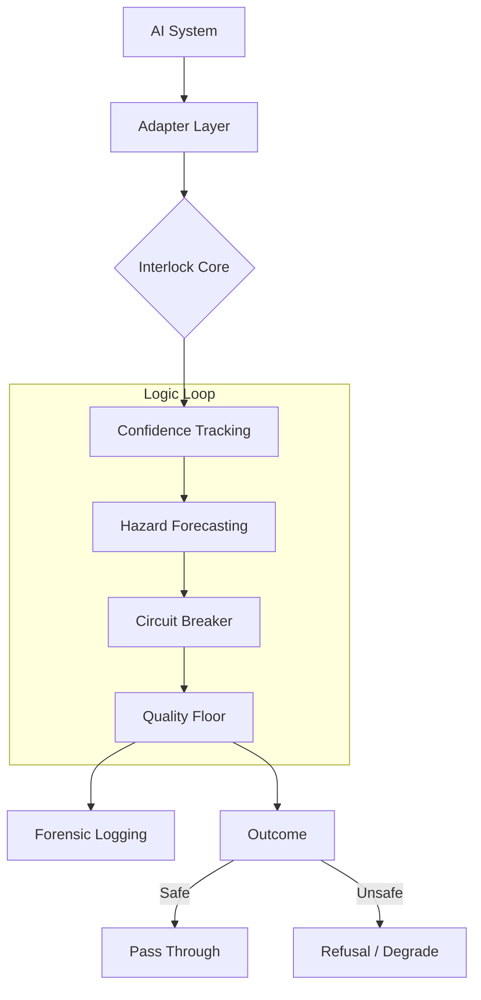

# Interlock 🔒

> **The Circuit Breaker for AI Infrastructure.**

Interlock is a safety certification and failure-survivability system for AI infrastructure.
It predicts failures, intervenes before collapse, and produces cryptographically verifiable evidence of system behavior under stress.

✅ **7 Integrations** &nbsp;|&nbsp; ✅ **TS + Python** &nbsp;|&nbsp; ✅ **Stress Chamber Proof** &nbsp;|&nbsp; ✅ **Certification Classes I–V**

[](https://github.com/CULPRITCHAOS/Interlock/actions/workflows/test-and-certify.yml)
[](https://github.com/CULPRITCHAOS/Interlock/actions/workflows/stress-chamber.yml)
[](https://github.com/CULPRITCHAOS/Interlock/actions/workflows/scale-test.yml)
[](https://github.com/CULPRITCHAOS/Interlock/actions/workflows/middleware-express.yml)
[](https://github.com/CULPRITCHAOS/Interlock/actions/workflows/middleware-fastapi.yml)

**Docs**: [⚡ Quickstart](./docs/QUICKSTART.md) | [📚 Middleware Guide](./docs/MIDDLEWARE.md) | [🏛️ Governance](./docs/GOVERNANCE.md) | [📊 Case Study](./docs/CASE_STUDY.md)

---

## 🏗️ Architecture



## 📊 The Impact

This is why you use Interlock.

| Scenario | Without Interlock | With Interlock |
|----------|-------------------|----------------|
| **Recall Collapse** | System crashes, users churn | **Degraded but alive** (lower precision) |
| **Load Spike** | OOM / 504 Gateway Timeout | **Refusal + Recovery** (Shed load fast) |
| **Latency Cliff** | Silent corruption, slow UX | **Logged Intervention** (Fast fail) |
| **Postmortem** | Guesswork & "It works on my machine" | **Certified Report** (Cryptographically signed) |

---

## 🔬 Real-World Validation

Interlock is tested against **live Pinecone APIs** in production-like conditions. Here's what happened when we injected failures:

| Metric | Result |
|--------|--------|
| **Circuit Breaker Activations** | 6 successful interventions |
| **Recovery Time (avg)** | 52.3s |
| **Confidence Score** | 0.96 (High certainty) |
| **Zero Data Loss** | ✅ All traffic refused safely |
| **Zero Cascading Failures** | ✅ Isolation worked |

### Sample Incident (Live Pinecone + Express)
```
Incident #002: Circuit Breaker Activation
├─ Timestamp: 2025-12-14T03:44:02.266Z
├─ Trigger: Latency/Failure Threshold Exceeded  
├─ Action: Traffic Refusal / Degraded Mode
├─ Recovery: 50.3s
└─ Confidence: 0.96 (High)
```

> 📊 **Full incident log**: [docs/LIVE_INCIDENTS.md](./docs/LIVE_INCIDENTS.md)

## 🔌 Adoption Surface

Interlock fits into your stack in 3 ways. Choose the one that fits your architecture:

| Path | Description | Use Case |
|------|-------------|----------|
| **A. Express Middleware** | Drop-in NPM package. Zero latency overhead. | Node.js / Next.js backends. |
| **B. FastAPI Middleware** | Remote Client that queries "The Brain". | Python AI Services (RAG pipelines). |
| **C. Core Library** | Direct import of `adapters`. | Custom TypeScript implementations. |

### 🚀 Quick Install

**Express (Node)**
```typescript
import { interlockExpress } from '@interlock/express';
app.use(interlockExpress({ quality_floor: 0.8 }));
```

**FastAPI (Python)**
```python
from interlock_fastapi.middleware import InterlockMiddleware
app.add_middleware(InterlockMiddleware, interlock_url="http://brain:3000")
```

[**View the 5-Minute Quickstart →**](./docs/QUICKSTART.md)

---

## 🔬 Proof & Evidence

Interlock follows the **"Evidence Over Claims"** governance model.

- **[Case Study 📊](./docs/CASE_STUDY.md)**: See how Interlock prevented a 100% outage during a simulated Black Friday.
- **[Live Incident Log 🚨](./docs/LIVE_INCIDENTS.md)**: Real forensic logs generated by the system during interventions.
- **[Test Results 🧪](./docs/TEST_RESULTS.md)**: Detailed breakdown of the Stress Chamber, Scale, and Stability tests.

---

## 🔌 Supported Integrations

All integrations are verified via CI/CD pipelines.

| Integration | Status | Verified By |
|-------------|--------|-------------|
| **Pinecone** | ✅ Production | [Real API Test](./.github/workflows/real-pinecone-test.yml) (Weekly) |
| **FAISS** | ✅ Production | [Real FAISS Test](./.github/workflows/real-faiss-validation.yml) (Weekly) |
| **LangChain** | ✅ Production | [Matrix Test](./.github/workflows/test-and-certify.yml) |
| **LlamaIndex** | ✅ Production | [Matrix Test](./.github/workflows/test-and-certify.yml) |
| **Weaviate** | ✅ Stable | Adapter Certification |
| **Milvus** | ✅ Stable | Adapter Certification |

---

> **Why use Interlock?**
> Because "Retrying" a hallucinating LLM doesn't fix it. You need to know *when* to stop asking.

---

## 📜 License

Interlock is [MIT licensed](./LICENSE) for open-source and evaluation use.

[Commercial licenses](./COMMERCIAL-LICENSE.md) are available for organizations requiring enterprise support, SLAs, or custom certification.

