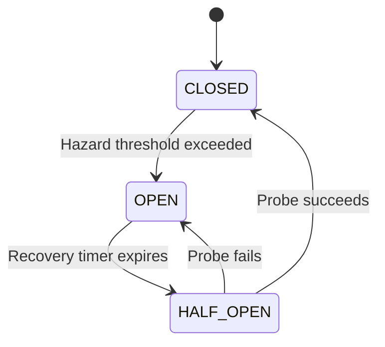

# Interlock Primitives Schema

> **Purpose**: Formal vocabulary for Interlock's safety primitives. Domain-agnostic, behavior-grounded definitions.

---

## Core Primitives

### Hazard

A measurable deviation from the expected operating envelope.

| Property | Value |
|----------|-------|
| **Type** | Observable Event |
| **Triggers** | Confidence < threshold, latency > baseline × 2, error rate > 5% |
| **Implication** | Heightened monitoring, not necessarily action |

**Behavior Contract**:
- `detect(metrics) → Hazard | null`
- `severity(hazard) → LOW | MEDIUM | HIGH`
- Hazards are stateless; they do not persist across cycles

---

### Reflex

An immediate, non-forecast safety action.

| Property | Value |
|----------|-------|
| **Type** | Reactive Action |
| **Trigger** | Hazard severity exceeds tolerance |
| **Duration** | Single decision cycle |

**Behavior Contract**:
- `trigger(hazard) → Action`
- `execute(action) → Result`
- Reflexes do NOT require state coordination
- Reflexes are idempotent

**Examples**: Traffic refusal, request shedding, immediate degradation.

---

### Guard

A sustained intervention across multiple decision cycles.

| Property | Value |
|----------|-------|
| **Type** | Stateful Policy |
| **Trigger** | Sustained hazard detection |
| **Duration** | Until explicit recovery criteria met |

**Behavior Contract**:
- `activate(guard) → State.OPEN`
- `probe(guard) → State.HALF_OPEN`
- `deactivate(guard) → State.CLOSED`
- Guards are NOT lifted by timeout alone; recovery requires success signal

**Examples**: Circuit breaker, quality floor, rate limiting.

---

### State

The operating mode of the circuit breaker.



| State | Behavior | Entry Condition | Exit Condition |
|-------|----------|-----------------|----------------|
| **CLOSED** | Normal. All traffic passes. | Probe success OR initial state | Hazard threshold |
| **OPEN** | Breaker tripped. Traffic refused. | Hazard threshold OR probe failure | Timer expiry |
| **HALF_OPEN** | Limited probes allowed. | Timer expiry from OPEN | Probe result |

**Invariant**: State transitions require sustained signals (hysteresis), not single events.

---

### Confidence

Internal belief in forecast validity.

| Property | Value |
|----------|-------|
| **Type** | Continuous value ∈ [0, 1] |
| **Source** | Recent observation history |
| **Decay** | Time-based without reinforcement |

**Thresholds**:
| Range | Interpretation | Action |
|-------|----------------|--------|
| ≥ 0.8 | High certainty | Normal operation |
| 0.5–0.79 | Moderate certainty | Protective mode |
| < 0.5 | Low certainty | Refusal required |

**Behavior Contract**:
- `compute(observations) → Confidence`
- `decay(confidence, dt) → Confidence'`
- Confidence is monotonically decreasing without positive signals

---

### Trust Decay

The derivative of confidence over time: `dC/dt`.

| Sign | Interpretation | Response |
|------|----------------|----------|
| Negative (dC/dt < 0) | Conditions deteriorating | Increase vigilance |
| Zero | Stable state | Maintain current mode |
| Positive (dC/dt > 0) | Conditions improving | Consider recovery |

**Behavior Contract**:
- `compute_decay(C, C_prev, dt) → dC/dt`
- Trust decay enables proactive intervention BEFORE confidence crosses thresholds

---

## Formal Invariants

These properties MUST hold for any Interlock-compliant implementation:

| Invariant | Statement |
|-----------|-----------|
| **No False Negatives** | If system is in failure state, Interlock MUST detect it |
| **Graceful Degradation** | Refusal is preferred over serving corrupt data |
| **Hysteresis** | State transitions require N consecutive signals, not N=1 |
| **Recovery Safety** | HALF_OPEN probes are limited and monitored |
| **Audit Trail** | Every state transition is logged with timestamp and cause |

---

## Relationships

```
Hazard Detection
       ↓
   [Severity?]
       ↓
  Low → Monitor (adjust Confidence)
  High → Reflex (immediate action)
       ↓
   [Sustained?]
       ↓
   Yes → Guard (State.OPEN)
   No → Return to monitoring
       ↓
   [Recovery?]
       ↓
   Timer → State.HALF_OPEN
   Probe Success → State.CLOSED
   Probe Fail → State.OPEN
```

---

## Implementation Status

| Primitive | Implemented | Tested | CI Verified |
|-----------|-------------|--------|-------------|
| Hazard | ✅ | ✅ | ✅ |
| Reflex | ✅ | ✅ | ✅ |
| Guard | ✅ | ✅ | ✅ |
| State | ✅ | ✅ | ✅ |
| Confidence | ✅ | ✅ | ✅ |
| Trust Decay | ✅ | ✅ | ✅ |

---

*This schema is designed for cross-domain reasoning and standards-level clarity.*

